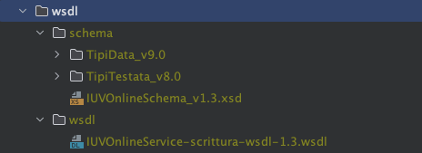
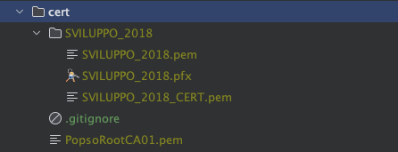

# Esempio di client per accedere a IUVOnline BPS

## Chiamata in PHP

### Installazione wsdl

Decomprimere, usando la password che vi è stata inviata dalla Banca, il file wsdlScrittura.zip o wsdlLettura.zip nella
directory wsdl.
Il risultato deve essere il seguente:



Modificare il wsdl immettendo endpoint inviato

### Installazione certificati

Decomprimere i certificati (SVILUPPO_2018) nella directory cert.
Anche in questo caso deve essere usata la password inviata.

Il risultato sarà il seguente:



### Environment

Rinominare ed eventualmente modificare opportunamente il file .env.example in .env

### XML della chiamata

Create un file xml valido per la chiamata nella directory xml. Il file deve contenere l'intera busta Soap necessaria per
la chiamata.

In caso di problemi è possibile usare il wsdl/xsd per generare una busta valida usando uno dei tanti software
disponibili, ad esempio [Soapui](https://www.soapui.org).

### Composer

Eseguire `composer install` per installare le dipendenze

### Chiamata Effettiva

Ora è possibile eseguire il file chiamata.php dentro la directory src

```bash
php chiamata.php
```

## Chiamata in Go

Nella directory src è presente anche un esempio di chiamata in Go.

Per eseguirla:

- modificare il file chiamata.go aggiungendo l'endpoint comunicato da BPS
- creare nella root del progetto il file request_body.txt dove deve essere inserita la busta soap completa
- eseguire in src
```bash
go run chiamata.go
```

## Chiamata via cUrl

È possibile verificare il funzionamento del servizio eseguendo una chiamata usando cUrl.

Si faccia riferimento a questo esempio:

```bash
curl --location '<ENDPOINT>' \
--key "./cert/SVILUPPO_2018/SVILUPPO_2018.pem" \
-E "./cert/SVILUPPO_2018/SVILUPPO_2018_CERT.pem" \
--cacert "./cert/PopsoRootCA01.pem" \
--header 'SoapAction: http://scrittura.iuvonline.nodospcit.ws.popso.it/v1/IUVOnlineCreate' \
--header 'Content-Type: text/xml' \
--data 'IMMETTERE QUI I DATI DA INVIARE'
```

## Certificati CA produzione

I certificati **pubblici** della CA e Intermediate CA sono presenti nella directory public_CA

I certificati di autenticazione per la produzione vi verranno consegnati da personale della Banca.
